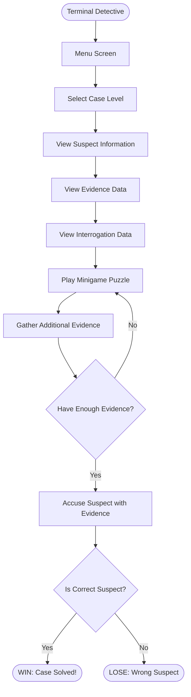
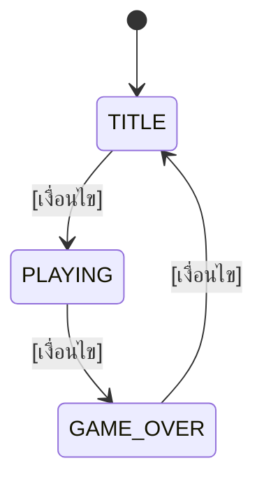

# 📝 [ชื่อโปรเจกต์ของกลุ่ม]

> **วิธีใช้ไฟล์นี้:** เขียนไฟล์นี้ **ก่อน** ลงมือเขียนโค้ด (spec-first) แล้วอัปเดตให้ตรงกับงานจริงก่อนส่ง
> ลบข้อความในวงเล็บเหลี่ยม `[ ... ]` และตัวอย่างที่เป็นตัวเอียงออก แล้วเขียนของกลุ่มเองแทน
> หัวข้อในไฟล์นี้เรียงตามเกณฑ์การให้คะแนน — ใช้เป็นโครงของสไลด์นำเสนอได้เลย

## 👥 ข้อมูลกลุ่ม

| รายการ                                           | รายละเอียด     |
| ------------------------------------------------------ | ------------------------ |
| ชื่อโปรเจกต์                               | Terminal Detective       |
| Track                                                  | Terminal (`conio.h`)  |
| Theme                                                  | Game Application         |
| ระดับความซับซ้อนที่ตั้งเป้า | พื้นฐาน           |

| รหัสนักศึกษา | ชื่อ-สกุล                     | หน้าที่หลัก (Coding / Presentation) |
| ------------------------ | ------------------------------------- | ---------------------------------------------- |
| 692110130                | ชญานนท์ คงนวล             | Coding                                         |
| 692110131                | ญานภัทร จันทร์เจริญ | Presentation                                   |
| 692110152                | ปิยพัทธ์ อุดมทิพย์   | Game Designer                                  |

## 💡 แนวคิด (ความคิดสร้างสรรค์)

**ไอเดียหลัก (2–3 ประโยค):**
เกมไขคดี หาหลักฐานจากข้อมูลที่มี และหาข้อมูลจาการแก้ Puzzle จะต้องชี้ตัวผู้ร้ายให้ถูก ตามหลักฐาน

**ต่างจาก template / ตัวอย่างอย่างไร:**
ทำเกมที่ไม่ได้มีในตัวอย่าง การใช้ระบบที่มีการคิดขึ้นมาเอง แต่ใช้ระบบพื้นฐานที่ได้เรียนมา

**Feature ของกลุ่ม:**

| # | Feature Must have                                                                                                 | สถานะ |
| :-: | ------------------------------------------------------------------------------------------------------------------ | :--------: |
| 1 | หน้าต่าง Menu                                                                                              |     ☐     |
| 2 | ข้อมูลผู้ต้องสงสัย Suspector                                                                     |     ☐     |
| 3 | ข้อมูลหลักฐานของผู้ต้องสงสัย Evidence                                                  |     ☐     |
| 4 | ข้อมูลที่ได้จากการสือสวน interrogation                                                     |     ☐     |
| 5 | แนบหลักฐาน ทุกหลักฐานจะมีระบบบอก ระดับความเป็นผู้ต้องสงสัย |     ☐     |

| # | Feature Nice to have                                                                                    | สถาณะ |
| - | -------------------------------------------------------------------------------------------------------- | :--------: |
| 1 | เลือกระดับความยาก Case Level                                                            |     ☐     |
| 2 | Minigame ที่จะให้แก้ Puzzle เพิ่อเอาหลักฐานเพิ่ม                          |     ☐     |
| 3 | ระบบพูดคุยกับผู้ต้องสงสัย                                                       |     ☐     |
| 4 | เนื้อเรื่องที่เกี่ยวข้องกับตัวผู้เล่นและผู้ต้องสงสัย |     ☐     |

## 🎮 วิธีใช้งาน / วิธีเล่น

| ปุ่ม / Input        | การทำงาน                             |
| ----------------------- | -------------------------------------------- |
| W , ลูกศรขึ้น | เลือกเมนูที่อยู่ด้านบน |
| S , ลูกศรลง     | เลือกเมนูที่อยู่ด้านบน |
| Enter                   | ยืนยันคำสั่ง                     |
| A , ลูกศรซ้าย  | เลือนไปทางซ้าย                 |
| D , ลูกศรขวา    | เลือนไปทางขวา                   |

**กติกา / เงื่อนไขชนะ-แพ้:**

- 1.ผู้เล่นต้องหาผู้ร้ายในคดี โดยใช้ขู้อมูลที่มีอยู่
- 2.ผู้เล่นสามารถหาข้อมูลได้จากการเล่น Minigame
- 3.ผู้เล่นต้องแนบหลักฐานไปประกอบการตัดสินใจ เพื่อชี้ตัวผู้ร้ายในคดี
- 4.ผู้เล่นจะชนะเมื่อหลักฐานเพียงพอ และชี้ตัวผู้ร้ายถูก
- 5.ผู้เล่นจะไม่สามารถชี้ตัวผู้ร้ายได้ ถ้าไม่แนบหลักฐาน
- 6.ผู้เล่นจะแพ้หากไม่ใช้ผู้ร้ายตัวจริงในคดี

## 🔁 Flow การทำงาน (Flowchart)

> แก้ไข diagram ด้านล่างให้ตรงกับงานของกลุ่ม (เขียนด้วย Mermaid — ดูผลได้ใน VS Code / GitHub) หรือวาดด้วยเครื่องมืออื่นแล้วแนบรูป

**State ของโปรแกรม:**

## 🧩 การประยุกต์ใช้เนื้อหาที่เรียน

> ไม่ต้องอธิบายทุกบรรทัด — เลือก **1–3 จุดเด่น** ที่เป็นแกนของไอเดียมาอธิบายตอนนำเสนอ ส่วนที่เหลือใส่ในตารางและ comment ในโค้ด

| หัวข้อ                                        | ใช้ที่ไหนในโค้ด (ชื่อฟังก์ชัน / ตัวแปร) | ทำไมถึงเลือกใช้ |
| --------------------------------------------------- | ------------------------------------------------------------------------ | ------------------------------ |
| Variable (W3)                                       | [ ... ]                                                                  | [ ... ]                        |
| Operation — Arithmetic / Relational / Logical (W4) | [ ... ]                                                                  | [ ... ]                        |
| Control — Selection (W5)                           | [ ... ]                                                                  | [ ... ]                        |
| Control — Repetition (W6)                          | [ ... ]                                                                  | [ ... ]                        |
| Function (W8)                                       | [ ... ]                                                                  | [ ... ]                        |
| Array (W9)                                          | [ ... ]                                                                  | [ ... ]                        |
| Pointer (W10)                                       | [ ... ]                                                                  | [ ... ]                        |
| *(เพิ่มเติม)* Struct / File I/O (W11)    | [ ... ]                                                                  | [ ... ]                        |

**จุดเด่นที่จะนำเสนอ:**

1. [ ... ]
2. [ ... ]

## 🧪 ทดสอบ (Demo 3–4 กรณี)

> ต้องมีอย่างน้อย 1 กรณีที่ผู้ใช้กรอก/กดผิด แล้วโปรแกรมรับมือได้ (ไม่ค้าง ไม่ปิดเอง)

| # | Input / สิ่งที่ทำ                                                  | ผลที่คาดหวัง                                             | ผลจริง | ผ่าน? |
| :-: | --------------------------------------------------------------------------- | -------------------------------------------------------------------- | ------------ | :-------: |
| 1 | [*กด 1 ที่หน้า Title* ]                                          | [*เริ่มเกมระดับง่าย* ]                            | [ ... ]      |    ☐    |
| 2 | [ ... ]                                                                     | [ ... ]                                                              | [ ... ]      |    ☐    |
| 3 | [ ... ]                                                                     | [ ... ]                                                              | [ ... ]      |    ☐    |
| 4 | [*กด 9 หรือตัวอักษรที่หน้า Title (ผิดปกติ)* ] | [*ขึ้นข้อความเตือน ยังอยู่หน้า Title* ] | [ ... ]      |    ☐    |

## 🤖 การใช้ AI

| รายการ                                              | รายละเอียด                                                               |
| --------------------------------------------------------- | ---------------------------------------------------------------------------------- |
| ระดับ AIAS ที่ใช้                              | ☐ 2: AI Planning ☐ 3: AI Collaboration ☐ 5: AI Exploration (feature เสริม) |
| เครื่องมือ                                      | [*เช่น ChatGPT, Claude, Copilot* ]                                           |
| ใช้ช่วยทำอะไร                                | [ ... ]                                                                            |
| ส่วนที่กลุ่มเขียน/ตัดสินใจเอง | [ ... ]                                                                            |

## ✅ Checklist ก่อนส่ง

- [ ] Compile ผ่านโดยไม่มี warning (`-Wall`)
- [ ] ลองเล่น/ใช้งานครบทุก state และทุกกรณีทดสอบในตารางด้านบน
- [ ] Comment อธิบายส่วนสำคัญในโค้ด (ส่วนที่ไม่ได้อธิบายตอนนำเสนอ)
- [ ] ไฟล์นี้ (`PROJECT.md`) กรอกครบ และ Flowchart ตรงกับโค้ดจริง
- [ ] Presentation 5–7 นาที ซ้อมจับเวลาแล้ว สมาชิกร่วมนำเสนอ
- [ ] บีบอัด source code เป็น `.zip` / `.7z` (ไม่ต้องใส่ `.exe`) แล้วส่งผ่าน MANGO ตามกำหนด
