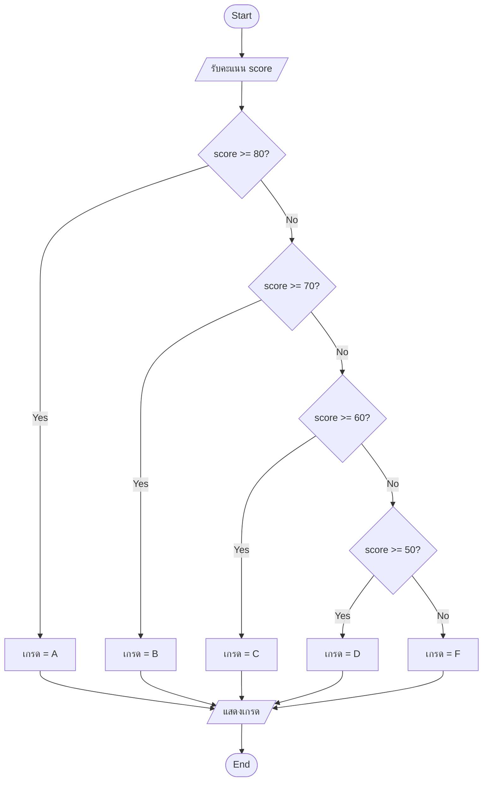
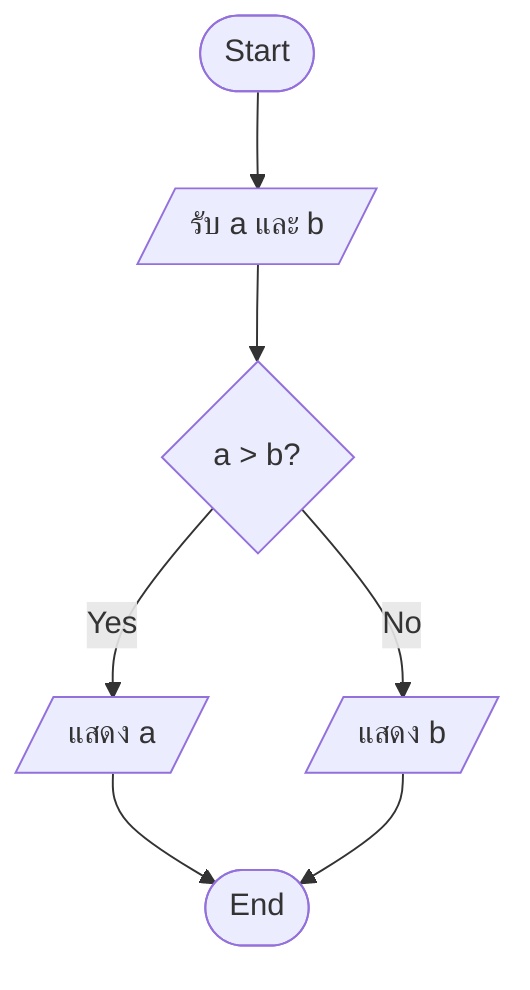
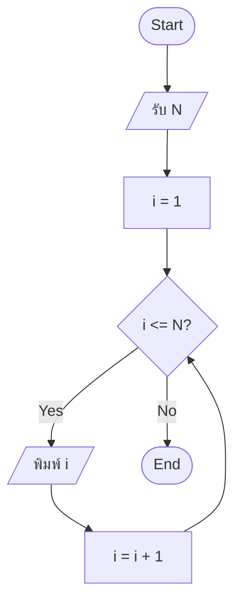

โจทย์ A — ตรวจสอบเกรด

```mermaid
flowchart TD
Start([Start]) --> Input[/รับคะแนน score/]
 Input --> D1{score >= 80?}
 D1 -- Yes --> A[เกรด = A]
 D1 -- No --> D2{score >= 70?}
 D2 -- Yes --> B[เกรด = B]
 D2 --No --> D3{score >= 60?}
 D3 -- Yes --> C[เกรด = C]
 D3 -- No -->D4{score >= 50?}
 D4 --Yes --> D[เกรด = D]
 D4 -- No --> F[เกรด = F]
 A & B & C & D & F --> Output[/แสดงเกรด/]
 Output --> End([End])
```

---

โจทย์ B — หาค่าสูงสุดจาก 2 ตัวเลข

```mermaid
flowchart TD
 Start([Start]) --> Input[/รับ a และ b/]
 Input --> Check{a > b?}
 Check -- Yes --> ShowA[/แสดง a/]
 Check -- No --> ShowB[/แสดง b/]
 ShowA --> End([End])
 ShowB --> End
```

---

โจทย์ C — นับจาก 1 ถึง N

```mermaid
flowchart TD
 Start([Start]) --> Input[/รับ N/]
 Input --> i1[i = 1]
 i1 --> Check{i <= N?}
 Check -- Yes --> wi[/พิมพ์ i/]
 Check -- No --> End([End])
 wi --> iplus[i = i + 1]
 iplus --> Check
```
