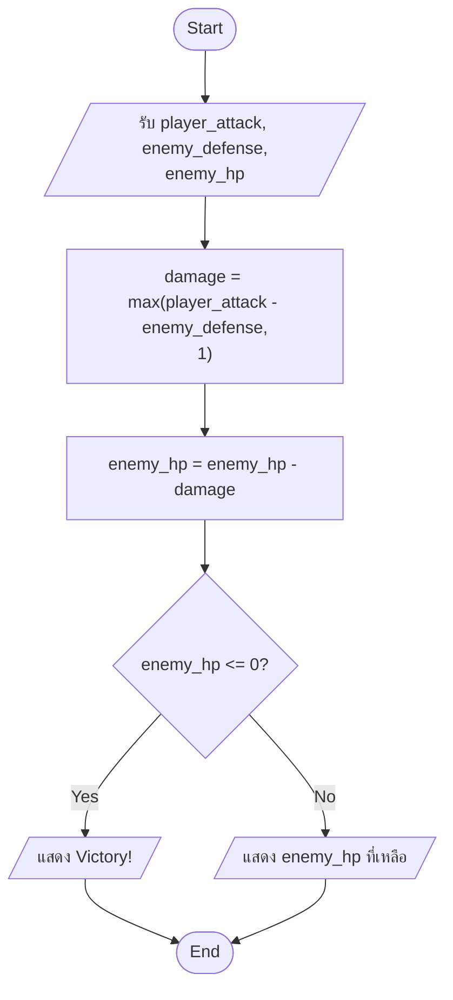
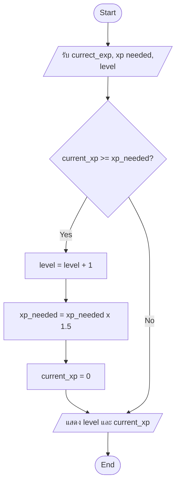
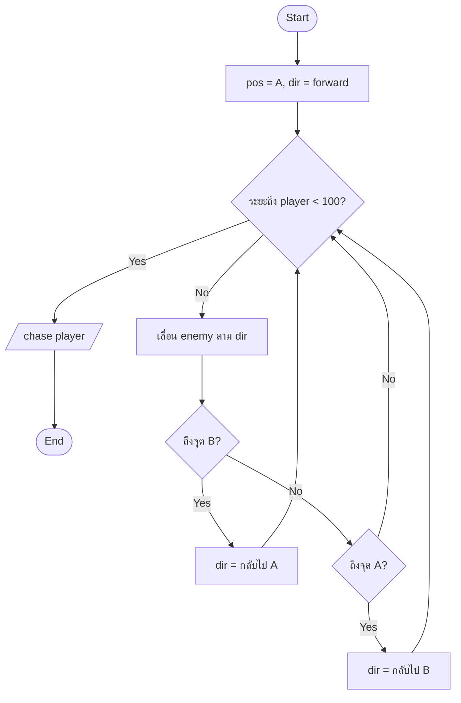

โจทย์ A — ระบบ Combat

```mermaid
flowchart TD
 Start([Start]) --> Input[/รับ player_attack, enemy_defense,
enemy_hp/]
 Input --> Calc["damage = max(player_attack - enemy_defense,
1)"]
 Calc --> Reduce["enemy_hp = enemy_hp - damage"]
 Reduce --> D1{enemy_hp <= 0?}
 D1 -->|Yes| Win[/แสดง Victory!/]
 D1 -->|No| Show[/แสดง enemy_hp ที่เหลือ/]
 Win & Show --> End([End])
```

---

โจทย์ B — ระบบ Level Up

```mermaid
flowchart TD
 Start([Start]) --> Input[/รับ currect_exp, xp needed,
level/]
 Input --> Calc{current_xp >= xp_needed?}
 Calc -- Yes --> levelup["level = level + 1"]
  levelup --> xpneed["xp_needed = xp_needed x 1.5"]
  xpneed --> currentxp["current_xp = 0"]
  currentxp --> showlevel
 Calc -- No --> showlevel[/แสดง level และ current_xp/]
 showlevel --> End([End])
```

---

โจทย์ C (ท้าทาย) — Simple AI Patrol

```mermaid
flowchart TD
 Start([Start]) --> set["pos = A, dir = forward"]
 set --> distance{ระยะถึง player < 100?}
 distance -- Yes --> chase[/chase player/]
 chase --> End([End])
 distance -- No --> patrol["เลื่อน enemy ตาม dir"]
 patrol --> bpoint{ถึงจุด B?}
 bpoint -- Yes --> backa["dir = กลับไป A"]
 bpoint -- No --> apoint{ถึงจุด A?}
 apoint -- Yes --> backb["dir = กลับไป B"]
 apoint -- No --> distance
 backb --> distance
 backa --> distance
```
